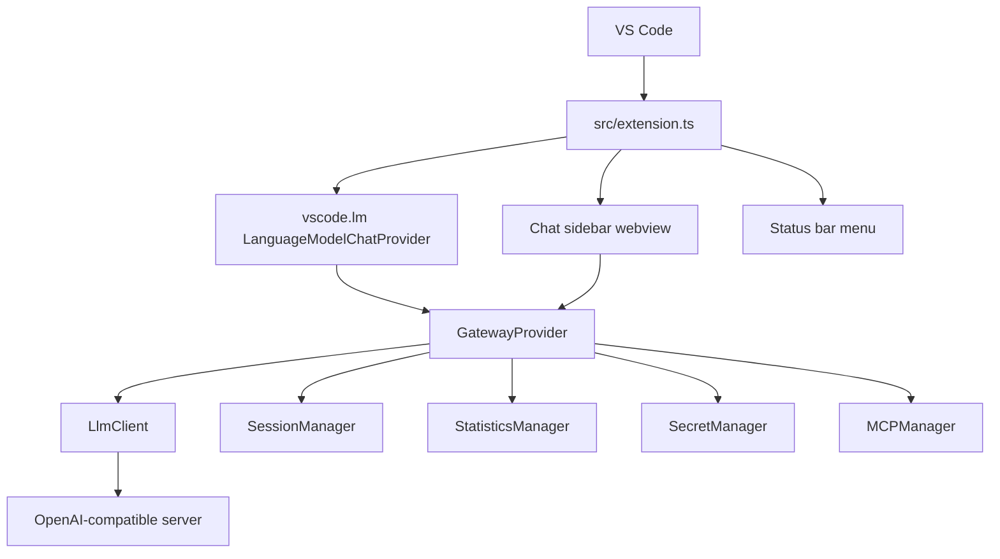
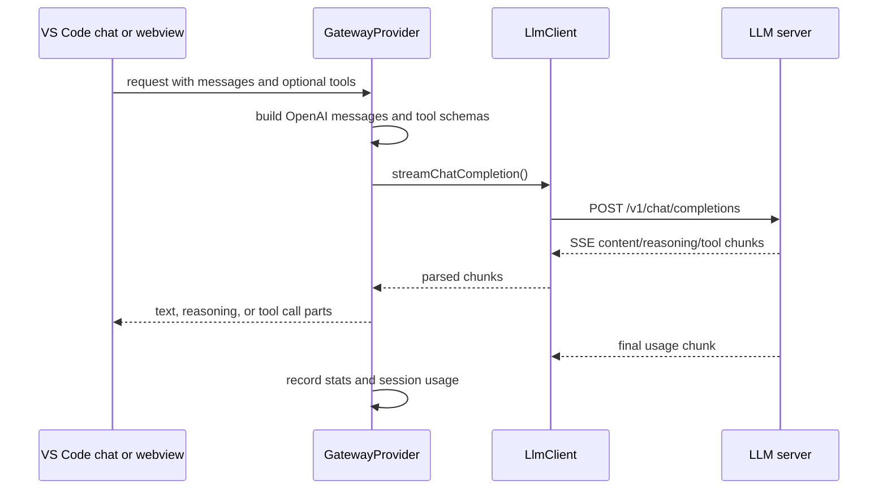

# API Documentation

This document describes the internal APIs and extension seams implemented in the current **Private Model Provider** codebase.

## Runtime Overview



```
+--------------------------------------------------------------+
¦                      VS Code                                 ¦
¦  +-----------------+    +----------------------------------+ ¦
¦  ¦  Copilot Chat   ¦?--?¦  Private Model Provider          ¦ ¦
¦  ¦                 ¦    ¦  +----------------------------+  ¦ ¦
¦  ¦                 ¦    ¦  ¦   GatewayProvider          ¦  ¦ ¦
¦  ¦                 ¦    ¦  ¦   - Message conversion     ¦  ¦ ¦
¦  ¦                 ¦    ¦  ¦   - Token management       ¦  ¦ ¦
¦  ¦                 ¦    ¦  ¦   - Tool call handling     ¦  ¦ ¦
¦  ¦                 ¦    ¦  +----------------------------+  ¦ ¦
¦  ¦                 ¦    ¦               ¦                  ¦ ¦
¦  ¦                 ¦    ¦  +------------?---------------+  ¦ ¦
¦  ¦                 ¦    ¦  ¦   GatewayClient            ¦  ¦ ¦
¦  ¦                 ¦    ¦  ¦   - HTTP requests          ¦  ¦ ¦
¦  ¦                 ¦    ¦  ¦   - SSE streaming          ¦  ¦ ¦
¦  ¦                 ¦    ¦  ¦   - Retry logic            ¦  ¦ ¦
¦  ¦                 ¦    ¦  +----------------------------+  ¦ ¦
¦  +-----------------+    +---------------+------------------+ ¦
+-----------------------------------------+--------------------+
                                          ¦
                                          ?
                             +------------------------+
                             ¦  Inference Server      ¦
                             ¦  (vLLM, Ollama, etc.)  ¦
                             ¦  OpenAI-compatible API ¦
                             +------------------------+
```

The extension exposes two paths:

- A VS Code `LanguageModelChatProvider` registered with vendor ID `private-model-provider`.
- A sidebar webview registered as `localModelProvider.chat` under the **Private Model** activity container.

## Core Classes

### `GatewayProvider`

Implemented in `src/provider.ts`. This is the main orchestration layer and implements `vscode.LanguageModelChatProvider`.

| Method | Purpose |
|---|---|
| `provideLanguageModelChatInformation()` | Fetches and maps available models for VS Code. Uses `/v1/models` and LM Studio metadata when available. |
| `provideLanguageModelChatResponse()` | Handles VS Code language model requests, streams responses, converts tool calls, records usage, and updates sessions. |
| `provideTokenCount()` | Estimates token count with a fast character-based heuristic. |
| `sendMessage()` | Non-streaming helper used by internal chat flows. |
| `streamMessage()` | Streaming helper used by the sidebar webview. |
| `refreshModels()` / `clearModelCache()` | Manages the cached model list. |
| `generateSessionTitle()` | Generates a concise session title from the first user message. |
| `applyLatestConfiguration()` | Reloads VS Code settings and updates the client. |
| `getSecretManager()` | Exposes the secret manager for commands such as API key updates. |

Key responsibilities:

- Converts VS Code chat messages and webview messages to OpenAI-compatible `messages`.
- Builds token budgets from `defaultMaxTokens`, `defaultMaxOutputTokens`, and estimated tool overhead.
- Sends OpenAI-style `tools`, `tool_choice`, and optional `parallel_tool_calls`.
- Parses streamed content, reasoning fields, tool calls, and final `usage` chunks.
- Stores session messages and token usage through `SessionManager`.
- Records global/session statistics through `StatisticsManager`.

### `LlmClient`

Implemented in `src/core/llmClient.ts`. This is the HTTP client for OpenAI-compatible endpoints.

| Method | Endpoint / Behavior |
|---|---|
| `fetchModels()` | `GET {serverUrl}/v1/models` |
| `fetchLMStudioModels()` | `GET {serverUrl}/api/v1/models` for richer LM Studio metadata |
| `streamChatCompletion()` | `POST {serverUrl}/v1/chat/completions` with `stream: true` and `stream_options.include_usage` |
| `completeChat()` | `POST {serverUrl}/v1/chat/completions` for non-streaming requests |
| `updateConfig()` | Replaces client configuration after settings changes |

Error handling includes retry with exponential backoff and jitter for transient failures. Retryable HTTP status codes are `429`, `500`, `502`, `503`, and `504`.

### `SecretManager`

Implemented in `src/secretManager.ts`.

| Method | Purpose |
|---|---|
| `getApiKey()` | Reads `private.model.provider.apiKey` from VS Code SecretStorage. |
| `setApiKey()` | Stores or removes the API key. |
| `deleteApiKey()` | Removes the API key. |
| `hasApiKey()` | Checks whether a key is configured. |

`getApiKey()` also migrates a legacy `private.model.provider.apiKey` setting into SecretStorage if one is found.

### `SessionManager`

Implemented in `src/sessionManager.ts`.

- Persists session metadata to `ai-logs/sessions.json` when a workspace is open.
- Persists messages to dated JSONL files under `ai-logs/YYYY-MM-DD/HHMM-<sessionId>.jsonl`.
- Falls back to extension global storage when no workspace folder is open.
- Emits `created`, `deleted`, `updated`, and `switched` events.
- Tracks per-session token usage by message type: `prompt`, `context`, `user`, `agent`, and `tools`.

### `StatisticsManager`

Implemented in `src/statistics.ts`.

- Tracks total requests, input tokens, output tokens, response timings, and per-model usage.
- Exposes formatting helpers for durations and token counts.
- Broadcasts updates so the status bar can reflect current usage.

### `MCPManager`

Implemented in `src/mcp.ts`.

- Loads `private.model.provider.mcpServers`.
- Starts and stops configured child processes.
- Currently exposes each configured MCP server as a simple OpenAI-style function schema with no parameters.
- Does not yet implement full MCP protocol negotiation or dynamic tool discovery.

## Configuration Interface

The runtime configuration used by `GatewayProvider` is defined as `GatewayConfig` in `src/types.ts`.

```ts
interface GatewayConfig {
  serverUrl: string;
  apiKey?: string;
  requestTimeout: number;
  defaultMaxTokens: number;
  defaultMaxOutputTokens: number;
  enableToolCalling: boolean;
  parallelToolCalling: boolean;
  agentTemperature: number;
  topP: number;
  frequencyPenalty: number;
  presencePenalty: number;
  maxRetries: number;
  retryDelayMs: number;
  modelCacheTtlMs: number;
  logLevel: 'debug' | 'info' | 'warn' | 'error';
}
```

See `docs/CONFIGURATION.md` for the full settings table.

## Commands

The following commands are contributed in `package.json`:

| Command ID | Title |
|---|---|
| `private-model-provider.setApiKey` | Set API Key (Secure) |
| `private-model-provider.showStatus` | Show Server Status |
| `private-model-provider.selectModel` | View Models & Set Default |
| `private-model-provider.switchServer` | Switch Server Preset |
| `private-model-provider.selectMcpTools` | Select MCP Tools |
| `private-model-provider.showStats` | View Usage Statistics |
| `private-model-provider.refreshModels` | Refresh Model Cache |
| `private-model-provider.testConnection` | Test Connection |
| `private-model-provider.createSession` | Create New Session |
| `private-model-provider.switchSession` | Switch to Session |
| `private-model-provider.generateSystemPrompts` | Generate System Prompts |
| `private-model-provider.deleteSession` | Delete Session |

Additional registered-but-not-contributed command IDs exist for internal or context-menu use, including `private-model-provider.showOutput`, `private-model-provider.startMcpServers`, `private-model-provider.stopMcpServers`, `private-model-provider.renameSession`, and `private-model-provider.editMasterPrompt`.

## Tool Calling Flow



The provider accepts both modern `tool_calls` chunks and legacy `function_call` chunks. It attempts to repair malformed JSON arguments and fill simple missing required properties before surfacing tool calls.

## Status Bar Menu

`StatusBarManager.showStatusMenu()` offers quick actions:

- View Models & Set Default
- Switch Server
- View Statistics
- Refresh Models
- Test Connection
- Generate System Prompts
- Select MCP Tools
- Open Settings
- Set API Key
- Show Output

## Extension Points

When adding features, update all relevant surfaces:

1. **Configuration**: `package.json`, `src/types.ts`, and `GatewayProvider.loadConfig()`.
2. **Commands**: `package.json`, `src/extension.ts`, and `src/commands.ts`.
3. **HTTP APIs**: `src/core/llmClient.ts`, then call from `src/provider.ts`.
4. **Webview behavior**: `src/ui/chatView.ts`, `src/ui/assets/main.js`, `src/ui/assets/index.html`, and `src/ui/assets/style.css`.
5. **Docs**: update the matching markdown file in `docs/`.

## Performance Notes

- Model lists are cached for `modelCacheTtlMs` milliseconds.
- Token counts are estimates unless the server returns final `usage`.
- Streaming uses plain `TextDecoder` parsing for compatibility with local servers.
- Some sampling fields are omitted when at defaults to avoid rejection by stricter OpenAI-compatible servers.
