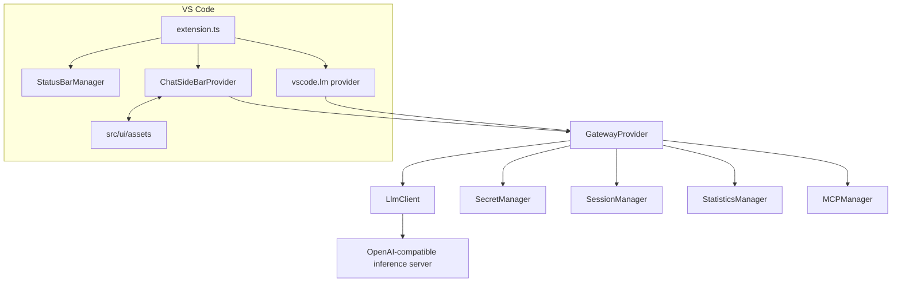

# Architecture Overview

This document describes the current architecture of the **Private Model Provider** VS Code extension.

## Components

## Activation

- The extension activates on `onStartupFinished`.
- `src/extension.ts` creates shared services: `StatisticsManager`, `SessionManager`, `StatusBarManager`, and `GatewayProvider`.
- The provider is registered with `vscode.lm.registerLanguageModelChatProvider('private-model-provider', provider)`.
- The sidebar webview is registered as `localModelProvider.chat`.
- A startup health check fetches model information and updates the status bar.

## Data Flow

### VS Code Language Model Provider

1. Another VS Code chat surface sends a request to vendor `private-model-provider`.
2. `GatewayProvider.provideLanguageModelChatResponse()` converts messages to OpenAI chat format.
3. The provider builds tool schemas when tool calling is enabled.
4. `LlmClient.streamChatCompletion()` posts to `/v1/chat/completions`.
5. Streamed text, reasoning, and tool calls are reported back to VS Code.
6. Final `usage` data updates statistics and session token usage.

### Sidebar Chat

1. `ChatSideBarProvider` loads `src/ui/assets/index.html`, `main.js`, and `style.css`.
2. The webview sends `webviewReady`, `requestSessions`, and `requestModels`.
3. User messages are posted with `command: 'sendMessage'`.
4. `GatewayProvider.streamMessage()` streams chunks to the webview.
5. The webview renders message chunks, reasoning chunks, tool-call events, and final usage.

## Persistence

- **API key**: stored in VS Code SecretStorage under `private.model.provider.apiKey`.
- **Session metadata**: stored in `ai-logs/sessions.json` when a workspace is open.
- **Session messages**: stored as JSONL in `ai-logs/YYYY-MM-DD/HHMM-<sessionId>.jsonl`.
- **No workspace fallback**: session data is stored under the extension global storage path.
- **Master prompt**: stored in `.llm/master.md`.
- **Model prompts**: stored in `.llm/prompts/<sanitized-model-id>/system.md` and `title.md`.

## Prompt Flow

- `PromptManager` loads a workspace master prompt from `.llm/master.md`.
- Session title generation uses `private.model.provider.smallModel` when configured, otherwise the selected/default model.
- Custom title prompt templates are read from `.llm/session.summary.md`.
- `private-model-provider.generateSystemPrompts` creates model-specific `system.md` and `title.md` files from packaged `PromptTemplates`.

## MCP Scope

MCP support is intentionally lightweight in the current implementation:

- `mcpServers` settings can launch configured child processes.
- `enabledMcpTools` controls which MCP tool names are allowed.
- Tool definitions are currently simple function schemas generated from configured server names.
- Full MCP protocol discovery/execution is not implemented yet.

## Important Naming

- Package/display name: `MFD: Private Model Provider`.
- Language model vendor ID: `private-model-provider`.
- Settings namespace: `private.model.provider.*`.
- Activity container ID: `localModelProvider`.
- Chat webview ID: `localModelProvider.chat`.

The `localModelProvider` IDs are legacy UI IDs that remain in package contributions and webview registration.
