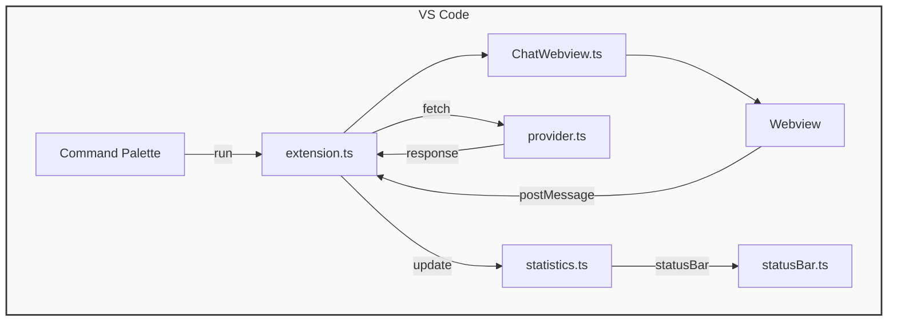

# Architecture Overview

This document describes the internal components of the **Private Model Provider** extension and how they interact.

## Component Diagram

## Data Flow
1. **Activation** – The extension activates when the `localModelProvider.startChat` command is executed.
2. **Webview Creation** – `ChatWebview.ts` creates a VS Code `WebviewPanel` that loads `assets/index.html`.
3. **User Interaction** – The front‑end (HTML/JS) sends messages to the extension host via `acquireVsCodeApi().postMessage`.
4. **Provider Call** – `extension.ts` forwards the request to `provider.ts`, which performs an HTTP request to the configured LLM endpoint.
5. **Response Handling** – The provider returns the assistant message and a `usage` object containing token counts.
6. **Statistics** – `statistics.ts` aggregates token usage and persists it in the extension's global state.
7. **Status Bar** – `statusBar.ts` reads the aggregated stats and updates a badge showing total tokens used.
8. **Webview Update** – The reply and updated token stats are posted back to the webview for display.

## Persistence
- **API Key** – Stored securely via VS Code `SecretStorage` (`secrets.ts`).
- **Token Stats** – Persisted in `globalState` (`Memento`) so they survive VS Code restarts.
- **Conversation History** – Saved to `ai-logs/YYYY-MM-DD/HHMM-chatId.jsonl` in the workspace root; can be exported/imported as JSON.

---
*The architecture is deliberately lightweight to keep the extension fast and easy to maintain.*