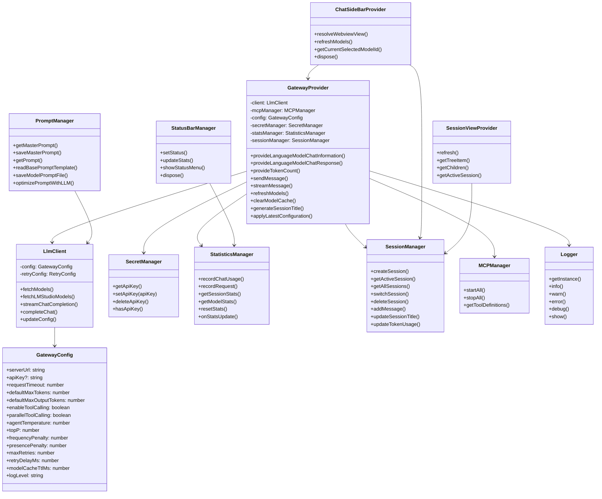

# Design Overview

This document summarizes the main classes in the current **Private Model Provider** implementation.

## Class Diagram

## Component Responsibilities

| Component | Responsibility |
|---|---|
| `GatewayProvider` | Main orchestration layer for VS Code provider requests and sidebar chat requests. |
| `LlmClient` | HTTP/SSE client for OpenAI-compatible model and chat endpoints. |
| `SecretManager` | Secure API key storage and legacy key migration. |
| `SessionManager` | Session metadata, message persistence, active session state, and per-session token usage. |
| `StatisticsManager` | Runtime usage statistics, response timing, and per-model counters. |
| `StatusBarManager` | Connection state, model count, stats display, and quick-action menu. |
| `ChatSideBarProvider` | Webview lifecycle and webview-to-extension message bridge. |
| `SessionViewProvider` | Tree provider and commands for session management. |
| `PromptManager` | Master prompt, model prompt, packaged templates, and prompt optimization. |
| `MCPManager` | Lightweight process lifecycle and simple tool schema exposure for configured MCP servers. |

## Design Patterns

| Pattern | Current Use |
|---|---|
| Facade | `GatewayProvider` hides client, sessions, stats, secrets, MCP, and tool-call details behind VS Code provider methods. |
| Adapter | Message conversion adapts VS Code chat parts and webview messages to OpenAI-compatible chat messages. |
| Observer | VS Code `EventEmitter` instances notify model-list changes and session changes. |
| Command | VS Code command IDs are registered in `extension.ts`, `commands.ts`, and `sessionView.ts`. |
| Strategy-like configuration | Retry counts, backoff delay, tool-calling behavior, sampling, and token budgets are runtime settings. |
| Singleton logger | `Logger.getInstance()` / `BaseLogger.getInstance()` provide shared logging sinks. |

## Important Implementation Notes

- The HTTP client class is `LlmClient` in `src/core/llmClient.ts`; older docs may refer to `GatewayClient`.
- There is no shipped plugin manager or DI container.
- There is no shipped CLI entry point.
- MCP support is currently a lightweight bridge, not full protocol-level tool discovery/execution.
- The chat webview ID is still `localModelProvider.chat` for compatibility with existing contributions.
