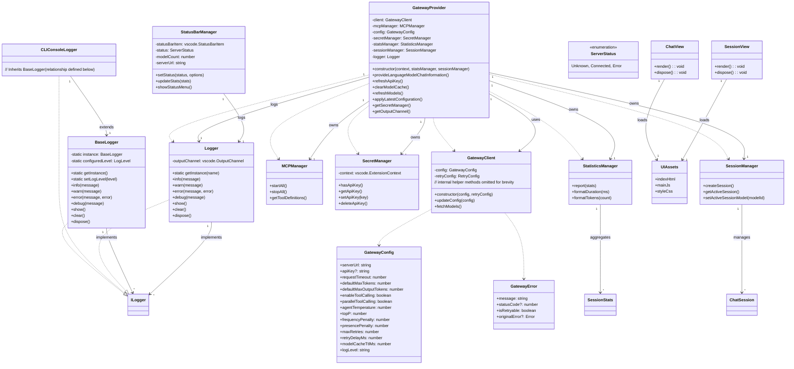
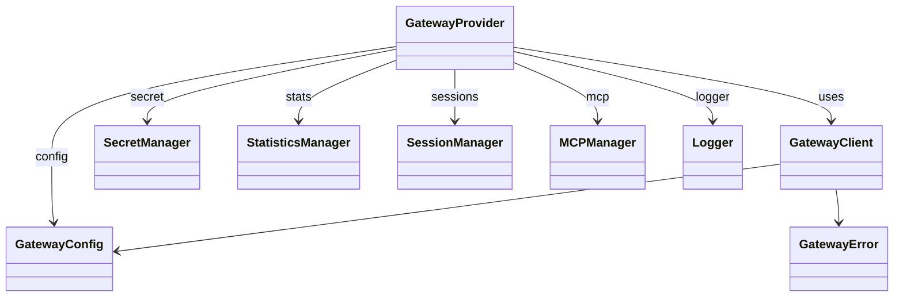

# Design Overview

This document provides a high‑level **class diagram** of the *Private Model Provider* VS Code extension and a brief explanation of each major class/interface.

---

## Mermaid Class Diagram

---

## Explanation of Major Components

| Component | Responsibility | Key Interactions |
|-----------|----------------|------------------|
| **GatewayClient** | Low‑level HTTP client that talks to an OpenAI‑compatible inference server. Handles retries, exponential back‑off, and streaming responses. | Used by **GatewayProvider** to fetch models and generate completions. |
| **GatewayProvider** | Implements `vscode.LanguageModelChatProvider`. Orchestrates request building, tool calling, logging, secret handling, and model caching. | Depends on **GatewayClient**, **SecretManager**, **StatisticsManager**, **SessionManager**, **MCPManager**, and **Logger**. |
| **SecretManager** | Securely stores and retrieves the API key via VS Code secret storage. | Provides the key to **GatewayClient** whenever the configuration changes. |
| **StatisticsManager** | Collects token usage, request latency, and other metrics. Formats values for display. | Updates **StatusBarManager** and can be queried by UI components. |
| **SessionManager** | Manages chat sessions (`ChatSession` objects), persists them to disk, and tracks the active session. | Used by **GatewayProvider** to attach messages to the correct session. |
| **MCPManager** | Starts and stops Model Context Protocol (MCP) servers defined in the extension settings. Exposes tool definitions for the LLM. | Supplies tool schemas to **GatewayProvider** when tool calling is enabled. |
| **StatusBarManager** | Shows connection status, model count, and response‑time metrics in VS Code’s status bar. | Listens to events from **GatewayProvider**, **StatisticsManager**, and configuration changes. |
| **BaseLogger / CLIConsoleLogger / Logger** | Unified logging abstraction. `BaseLogger` is a console‑only logger used by the CLI; `Logger` writes to a VS Code output channel. | All core classes receive a logger instance for consistent diagnostics. |
| **ChatView / SessionView** | Webview UI that renders the chat interface and session list. Loads static assets from `src/ui/assets`. | Communicates with **GatewayProvider** via the VS Code webview messaging API. |
| **Core Interfaces (`ILogger`, `IConfigProvider`, …)** | Define contracts that keep the core layer free of VS Code dependencies, enabling reuse in non‑VS Code contexts (e.g., CLI). | Implemented by concrete classes in the `src` folder. |

### How the Pieces Fit Together
1. **Activation** (`extension.ts`) creates the singleton services (`GatewayProvider`, `StatusBarManager`, `StatisticsManager`, `SessionManager`).
2. When a user opens the chat sidebar, `ChatView` loads the HTML/JS/CSS assets and establishes a message channel with the extension.
3. User prompts are forwarded to **GatewayProvider**, which:
   - Retrieves the API key via **SecretManager**.
   - Builds a request using the current **GatewayConfig**.
   - Calls **GatewayClient** to stream a completion.
   - Updates **StatisticsManager** with token usage and latency.
   - Sends tool call results back to the webview if the model requests them.
4. **StatusBarManager** reflects the connection state and recent response times, pulling data from **StatisticsManager**.
5. **MCPManager** runs optional background servers that expose additional tools; their definitions are merged into the request payload.
6. All logging goes through the appropriate logger implementation, ensuring a consistent output format whether the extension runs inside VS Code or via the CLI.

---

## Extending the Diagram
If new classes are added (e.g., additional UI panels, custom tool integrations, or a new CLI entry point), extend the Mermaid diagram by adding a `class` block and linking it with the appropriate relationships (`-->`, `..|>` for inheritance, etc.).

## Design Patterns Used

The extension employs several classic design patterns to keep the architecture modular, testable, and extensible.

| Pattern | Where it appears | How it is used |
|---------|------------------|----------------|
| **Singleton** | `src/core/BaseLogger.ts` | `BaseLogger` holds a static `instance` and a private constructor, exposing `BaseLogger.getInstance()` so the same logger is shared across the CLI and the VS Code extension. |
| **Factory** | `src/vscodeLogger.ts` (via `getLogger`, `getConsoleLogger`) | Helper functions decide which concrete `ILogger` implementation to return (VS Code output‑channel logger or console logger). |
| **Dependency Injection** | `src/provider.ts`, `src/extension.ts`, `src/statusBar.ts` | Core services (`GatewayClient`, `MCPManager`, `SecretManager`, `StatisticsManager`, `SessionManager`, `Logger`) are passed into constructors rather than being created inside the class. This makes the components loosely coupled and easy to test. |
| **Facade** | `src/provider.ts` (`GatewayProvider`) | `GatewayProvider` presents a simple `vscode.LanguageModelChatProvider` API while internally coordinating many subsystems (client, MCP, secret handling, statistics, session manager). |
| **Strategy (Retry/Back‑off)** | `src/core/gatewayClient.ts` (`GatewayClient`) | The client’s request logic (`requestWithRetry` in `GatewayProvider` and the exponential‑back‑off logic in `GatewayClient`) can be swapped by changing the `maxRetries` and `retryDelayMs` configuration – a classic Strategy pattern. |
| **Observer / Event‑Emitter** | `src/provider.ts` (`_onDidChangeLanguageModelChatInformation`) and `src/statusBar.ts` (`ServerStatus` updates) | VS Code `EventEmitter` objects broadcast changes (e.g., model list updates, server‑status changes) to any listeners, decoupling producers from consumers. |
| **Command** | `src/extension.ts` (registration of VS Code commands) | Commands such as `private-model-provider.setApiKey`, `showStatus`, `selectModel`, and `switchServer` are encapsulated as command objects that VS Code can invoke. |
| **MVC‑like separation** | `src/ui/*` (web‑view UI) vs. `src/*` (business logic) | UI components (`ChatView`, `SessionView`) are pure presentation layers that interact with the core services through well‑defined interfaces, keeping view logic separate from model/provider logic. |
| **Factory (Logger creation)** | `src/vscodeLogger.ts` (`getLogger`) | Centralised logger creation abstracts away whether the logger writes to the VS Code output channel or the console. |
| **Strategy (Server preset handling)** | `src/extension.ts` (server‑preset commands) | The logic for switching servers is driven by configuration; the provider reads the current preset and adapts its behaviour without hard‑coding any particular server. |

These patterns together give the extension a clean architecture that is easy to maintain and extend.

---

*Generated on 2026‑06‑22.*

## Provider Approach Class Diagram

The following diagram shows only the classes that are directly involved when the `GatewayProvider` is used as a language‑model chat provider (e.g., by GitHub Copilot or another chat client). It focuses on the provider itself and the services it depends on.

