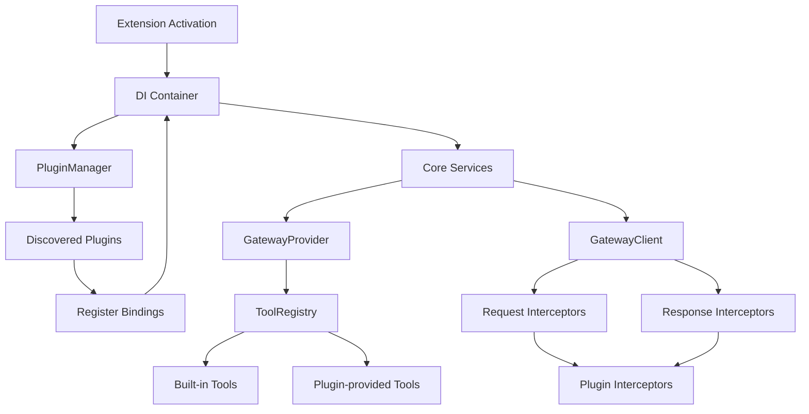
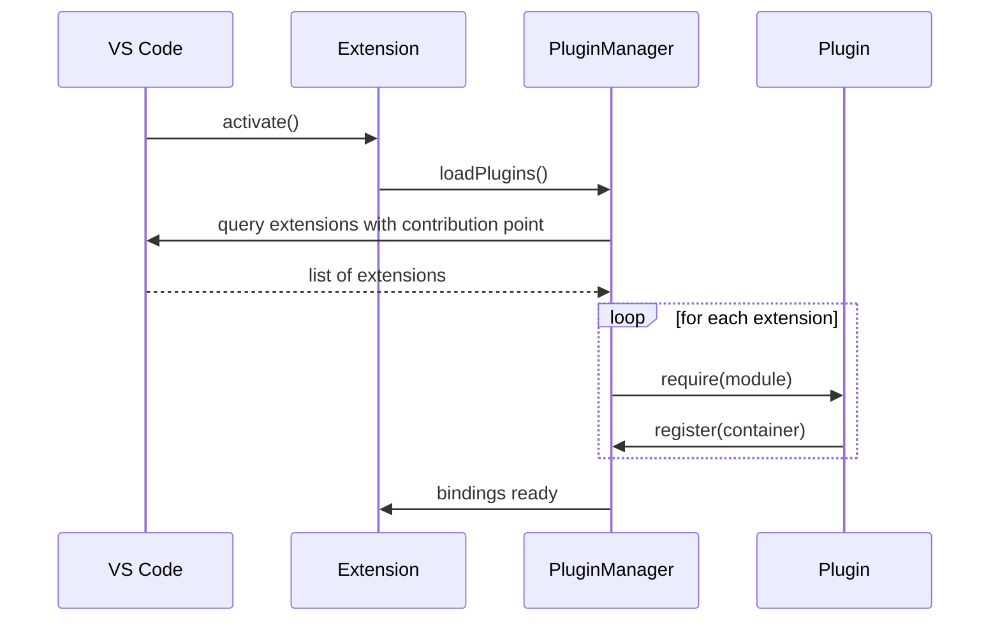
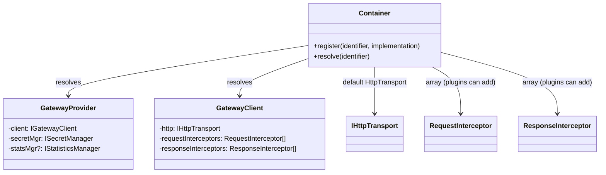

# Extensibility – Plugin Architecture (NFR‑016)

## Overview
The extension currently provides a solid core for interacting with OpenAI‑compatible inference servers, but the **Extensibility – Plugin Architecture** requirement is only *partial*.  To achieve full extensibility we need:

1. **Public plugin interfaces** that third‑party extensions can implement.
2. A **dependency‑injection (DI) container** so the core can be wired with custom implementations.
3. **Plugin discovery & registration** via a VS Code contribution point.
4. **Hook points** in the client/provider for request/response interception and tool registration.
5. **Configuration schema** to enable/disable plugins and pass plugin‑specific options.
6. Updated **documentation** and **tests**.

The following sections describe an implementation plan and include architecture diagrams (Mermaid) that can be rendered directly in the docs.

---

## Implementation Plan

| Phase | Tasks | Expected Outcome |
|-------|-------|------------------|
| **1 – Define Interfaces** | • Create `src/types/plugin.ts` with interfaces: `LanguageModelProviderPlugin`, `GatewayClientPlugin`, `ToolProviderPlugin`, `RequestInterceptor`, `ResponseInterceptor`. <br>• Export these from a new `src/plugin.ts` barrel file. | Public contracts for plugins. |
| **2 – Introduce DI Container** | • Add a lightweight container (e.g., `inversify` or a hand‑rolled map). <br>• Refactor `GatewayProvider` and `GatewayClient` constructors to accept abstractions (`IGatewayClient`, `ISecretManager`, etc.). <br>• Register core implementations as default bindings. | Core becomes configurable without code changes. |
| **3 – Plugin Manager** | • Add `src/pluginManager.ts` that scans `vscode.extensions.all` for the contribution point `localModelProvider.plugins`. <br>• Load each plugin module and call a known `register(container: Container)` function. <br>• Store loaded plugins for later disposal. | Automatic discovery and registration of external plugins. |
| **4 – Hook Points** | • Extend `GatewayClient` with arrays of `requestInterceptors` and `responseInterceptors`. <br>• Invoke them in `fetchWithRetry` and `streamChatCompletion`. <br>• Add a `ToolRegistry` service that plugins can extend. | Plugins can modify HTTP calls, stream handling, and add new tools. |
| **5 – Configuration Schema** | • Update `package.json` contributes.configuration to include a `plugins` object. <br>• Add per‑plugin enable/disable flags and an optional `options` object. | Users can control which plugins are active. |
| **6 – Documentation & Tests** | • Write a **Plugin Architecture** section in `docs/ARCHITECTURE.md` (this file). <br>• Add a sample dummy plugin under `samples/plugin-demo/`. <br>• Unit‑test the container, plugin loading, and a mock interceptor. | Clear guidance for contributors and regression safety. |
| **7 – Release** | • Bump version, update changelog, run `npm run esbuild` and publish. | New version with full extensibility support. |

---

## Architecture Diagrams

### 1. High‑Level Extensibility Architecture


### 2. Plugin Discovery Flow


### 3. DI Container & Service Resolution


---

## How to Create a Plugin
1. **Add a contribution** in your extension’s `package.json`:
```json
"contributes": {
  "localModelProvider": {
    "plugins": [
      "my-plugin/dist/index.js"
    ]
  }
}
```
2. **Export a `register` function**:
```ts
import { Container } from 'inversify';
export function register(container: Container) {
  container.bind<IToolProvider>('ToolProvider').to(MyToolProvider).inSingletonScope();
  container.bind<RequestInterceptor>('RequestInterceptor').to(MyInterceptor);
}
```
3. **Publish** the extension. The host extension will automatically load it on activation.

---

## Next Steps for the Core Team
- Choose a DI library (or keep the simple map implementation). <br>- Draft the `src/types/plugin.ts` file. <br>- Implement `PluginManager` and add the contribution point to `package.json`. <br>- Write the sample plugin under `samples/`. <br>- Update CI to run the new unit tests.

---

*This document lives in `docs/PLUGIN_ARCHITECTURE.md` and is referenced from the main `ARCHITECTURE.md` file.*
