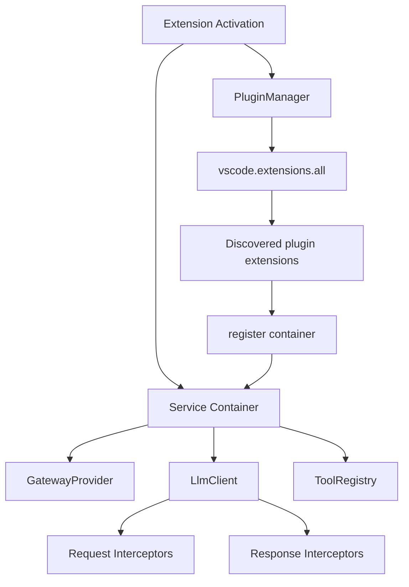

# Extensibility and Plugin Architecture

## Current State

The current implementation does **not** include a public plugin architecture, dependency-injection container, plugin contribution point, or plugin manager.

Implemented extensibility today is limited to:

- VS Code language model provider integration through vendor ID `private-model-provider`.
- OpenAI-compatible inference servers configured by `private.model.provider.serverUrl`.
- Built-in tool schemas from `src/tools.ts`.
- Lightweight MCP server configuration through `private.model.provider.mcpServers`.
- User-selected MCP tool names through `private.model.provider.enabledMcpTools`.
- Prompt customization through `.llm/master.md`, `.llm/session.summary.md`, and `.llm/prompts/<model-id>/`.

## MCP Integration Scope

`src/mcp.ts` currently:

1. Reads configured MCP server process definitions.
2. Starts/stops those processes.
3. Maps each configured server name to a simple OpenAI-style function schema.

It does not yet:

- Perform full MCP protocol initialization.
- Query server-provided tools dynamically.
- Execute MCP tool calls through the MCP protocol.
- Provide a third-party extension contribution point.

## Future Plugin Architecture

The following design remains a proposed plan, not shipped behavior.

### Goals

1. Public plugin interfaces for third-party extensions.
2. A small service registry or DI container.
3. VS Code contribution point for plugin discovery.
4. Request/response interceptors around `LlmClient`.
5. Tool registration hooks.
6. Per-plugin configuration.
7. Tests and sample plugins.

### Proposed Components



### Proposed Contribution Point

```json
{
  "contributes": {
    "privateModelProvider": {
      "plugins": [
        "dist/index.js"
      ]
    }
  }
}
```

The old proposed name `localModelProvider.plugins` should not be used for new work because the settings and command namespace are now `private.model.provider.*` and `private-model-provider.*`.

### Proposed Plugin Shape

```ts
export interface PrivateModelProviderPlugin {
  id: string;
  activate(context: PluginContext): Promise<void> | void;
  deactivate?(): Promise<void> | void;
}

export interface PluginContext {
  tools: ToolRegistry;
  requestInterceptors: RequestInterceptorRegistry;
  responseInterceptors: ResponseInterceptorRegistry;
  configuration: unknown;
}
```

## Implementation Checklist

- Add public interfaces under `src/types/plugin.ts`.
- Add a `src/plugin.ts` barrel export.
- Add a `PluginManager` that discovers contribution points.
- Add a registry for request interceptors, response interceptors, and tool providers.
- Refactor provider/client constructors only where it reduces coupling; avoid a broad DI rewrite unless tests justify it.
- Add package contribution schema and user settings for plugin enable/disable state.
- Add a sample plugin under `samples/`.
- Add tests for discovery, activation failure isolation, and interceptor ordering.

Until those items exist in code, documentation should refer to plugins as planned work only.
