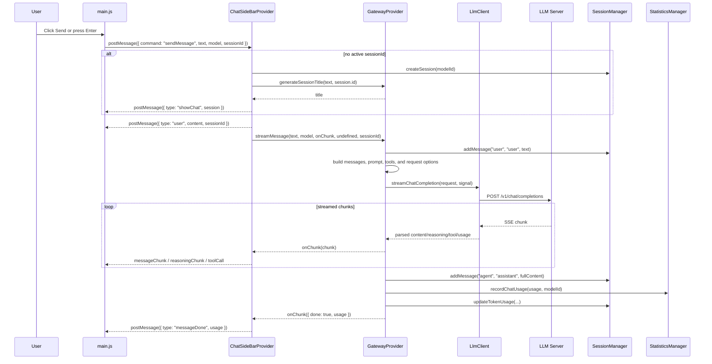

# Send Message Flow

This document describes the current flow when a user sends a message through the **Private Model** sidebar webview.

## Sequence

## Webview Behavior

`src/ui/assets/main.js`:

- Sends `webviewReady`, `requestSessions`, and `requestModels` when loaded.
- Sends `sendMessage` with `text`, `model`, and `sessionId`.
- Uses Enter to send and Shift+Enter for newlines.
- Renders:
  - `sessions`
  - `models`
  - `showChat`
  - `user`
  - `messageChunk`
  - `reasoningChunk`
  - `toolCall`
  - `messageDone`
  - `messageError`

## Extension Bridge

`src/ui/chatView.ts`:

- Registers the webview provider for `localModelProvider.chat`.
- Loads static assets from `src/ui/assets`.
- Fetches models through `GatewayProvider.provideLanguageModelChatInformation()`.
- Fetches sessions through `SessionManager.getAllSessions()`.
- Creates a session before calling `streamMessage()` when the webview sends no `sessionId`.
- Starts title generation asynchronously and posts `showChat` when a title is available.

## Provider Request Preparation

`GatewayProvider.streamMessage()`:

- Waits for provider initialization.
- Determines the target model from the webview selection, session state, default model, or fetched model list.
- Adds the user message to the session.
- Loads `.llm/master.md` when available.
- Builds OpenAI-compatible `messages`.
- Uses `defaultMaxOutputTokens`, `agentTemperature`, and `stream_options.include_usage`.
- Adds built-in tool definitions from `src/tools.ts`.
- Applies MCP tool filtering through `enabledMcpTools` where applicable.

## Streaming Response Handling

`LlmClient.streamChatCompletion()`:

- Posts to `/v1/chat/completions`.
- Parses SSE `data:` lines.
- Supports content fields, reasoning fields, modern `tool_calls`, legacy `function_call`, and final `usage`.
- Emits the last captured `usage` at stream completion.

`GatewayProvider.streamMessage()`:

- Accumulates assistant content.
- Emits reasoning chunks separately.
- Emits tool-call chunks and can execute supported local helper tools.
- Saves the assistant response to the active session.
- Records usage in `StatisticsManager`.
- Updates session token usage by message type.

## Configuration Used

- `private.model.provider.serverUrl`
- `private.model.provider.defaultModel`
- `private.model.provider.smallModel`
- `private.model.provider.defaultMaxOutputTokens`
- `private.model.provider.agentTemperature`
- `private.model.provider.enableToolCalling`
- `private.model.provider.parallelToolCalling`
- `private.model.provider.enabledMcpTools`
- `.llm/master.md`
- `.llm/session.summary.md`

## Current Limitations

- The Stop button posts `stopRequest`, but full cancellation wiring is limited in the current sidebar path.
- The sidebar does not expose Clear, Export, or Import controls.
- Full MCP protocol execution is not implemented; MCP settings currently produce simple tool schemas from configured server names.
