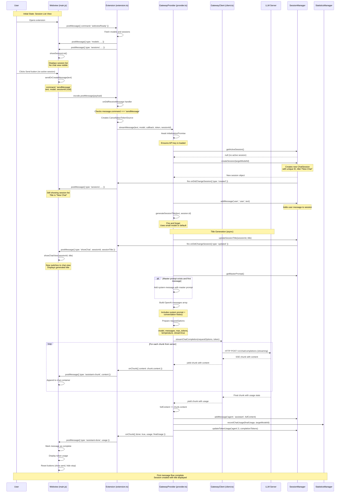

# Send Message Flow - Private Model Provider

This document describes the complete flow when a user sends their first message through the Private Model Provider extension.

## Flow Diagram

## Detailed Flow Explanation

### Initial State (Webview Loads)
- Webview displays the **session list** by default (not the chat view)
- The **input controls** (textarea, model selector, send/stop buttons) are always visible at the bottom
- If there's an active session with a proper title (not "New Chat"), the chat view is shown

### 1. User Action
The user types a message in the textarea and clicks the **Send** button (or presses Enter).

### 2. Webview Processing (`main.js`)
- The `sendOrCreateMessage(text)` function is called
- It retrieves the selected model from the dropdown
- Creates a payload with:
  - `command: 'sendMessage'`
  - `text`: The user's message
  - `model`: The selected model ID
  - `sessionId`: `null` (since this is the first message)
- Sends the payload using `vscode.postMessage(payload)`
- Toggles button visibility: shows **Stop** button, hides **Send** button

### 3. Extension Message Handler (`extension.ts`)
- The `onDidReceiveMessage` callback in `ChatSideBarProvider` receives the message
- Validates that `message.command === 'sendMessage'`
- Creates a `CancellationTokenSource` to allow request cancellation
- Calls `provider.streamMessage()` with:
  - The user's text
  - The selected model
  - A callback function to handle streaming chunks
  - The cancellation token
  - The session ID (null for first message)

### 4. Provider Initialization (`provider.ts`)
- `streamMessage()` awaits `initializationPromise` to ensure:
  - API key is loaded from secure storage
  - Configuration is properly initialized

### 5. Session Management
- Checks for an active session via `sessionManager.getActiveSession()`
- Since this is the first message, no active session exists
- Creates a new session using `sessionManager.createSession(targetModelId)`
  - Generates a unique session ID
  - Sets the session title to "New Chat" (will be updated later)
  - Stores the selected model as `lastUsedModel`
- Adds the user's message to the session via `sessionManager.addMessage()`
- Fires `onDidChangeSession({ type: 'created' })` event
  - Extension receives event, sends updated sessions to webview
  - Since title is "New Chat", webview stays on session list

### 6. Title Generation (Fire and Forget)
- `generateSessionTitle()` is called asynchronously
- Uses the configured `smallModel` or falls back to `defaultModel`
- Sends a request to the LLM to generate a concise title (10 words or less)
- Updates the session title when complete
- Calls `sessionManager.updateSessionTitle()` which fires `onDidChangeSession({ type: 'updated' })`
- Extension receives event and sends `sessionTitleUpdated` message to webview
- Webview switches to chat view with the new title

### 7. Request Preparation
- Retrieves the master prompt from session manager (if configured)
- If this is the first message and a master prompt exists:
  - Adds it as a system message with `messageType: 'prompt'`
- Builds the OpenAI-compatible messages array:
  - System message (master prompt, if any)
  - All previous conversation history from the session
- Prepares `requestOptions`:
  - `model`: Target model ID
  - `messages`: Array of conversation messages
  - `max_tokens`: From config (default: 2048)
  - `temperature`: 0.7
  - `stream: true`
  - `stream_options: { include_usage: true }`

### 8. Streaming Request
- Calls `client.streamChatCompletion(requestOptions, token)`
- The client makes an HTTP POST to `/v1/chat/completions` with streaming enabled
- Server responds with Server-Sent Events (SSE)

### 9. Streaming Response Loop
For each chunk received from the server:
- **Content chunks**: 
  - Client yields `{ content: chunk.text }`
  - Provider accumulates `fullContent += chunk.content`
  - Provider calls `onChunk({ content: chunk.content })`
  - Extension posts `assistant-chunk` message to webview
  - Webview appends the content to the chat container in real-time
  
- **Usage chunk** (final chunk):
  - Contains token usage statistics
  - Provider stores `finalUsage` for statistics

### 10. Completion Handling
- Provider adds the complete assistant response to the session
- Records token usage statistics via `statsManager.recordChatUsage()`
- Updates session token usage for different message types
- Calls `onChunk({ done: true, usage: finalUsage })`
- Extension posts `assistant-done` message to webview

### 11. Webview Update
- Marks the last assistant message as complete (removes `data-streaming` attribute)
- Displays token usage information (if available)
- Resets button visibility: shows **Send**, hides **Stop**
- Clears the `currentRequestId`

### 12. Cancellation Support
Throughout the streaming process:
- The cancellation token is checked at the start of each iteration
- If the user clicks **Stop**, the token is cancelled
- The loop breaks, and a `cancelled: true` flag is sent to the webview
- The webview marks the message with "[Stopped]"

## Key Components

| Component | File | Responsibility |
|-----------|------|----------------|
| Webview UI | `src/ui/assets/main.js` | Handles user input, displays messages, manages UI state |
| Webview Styles | `src/ui/assets/style.css` | Theming and layout |
| Extension | `src/extension.ts` | Registers providers, handles webview messages |
| Provider | `src/provider.ts` | Core logic, session management, streaming |
| Client | `src/client.ts` | HTTP communication with LLM server |
| Session Manager | `src/sessionManager.ts` | Chat session persistence and history |
| Statistics Manager | `src/statistics.ts` | Token usage tracking and statistics |

## Configuration Options Used

- `private.model.provider.defaultModel`: Default model to use
- `private.model.provider.smallModel`: Model for title generation
- `private.model.provider.serverUrl`: LLM server endpoint
- `private.model.provider.defaultMaxOutputTokens`: Max tokens in response
- Master prompt: `.llm/SystemPrompt.md` in workspace root

## Error Handling

- If no model is selected, an error is posted to the webview
- If the server is unreachable, the error is caught and displayed
- If the request is cancelled, the stream stops gracefully
- API key errors are handled during initialization
